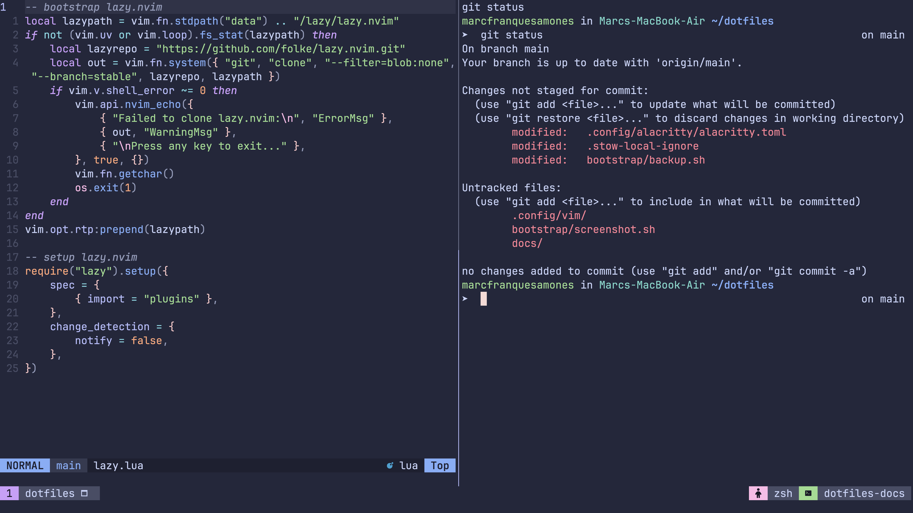

# Marc's dotfiles

Several configuration files that work on my machine.
I am conforming to the [XDG Base Directory](https://wiki.archlinux.org/title/XDG_Base_Directory) specification to minimize files in `$HOME`.

## Thanks
I have taken inspiration at different stages from several people, including [Mathias](https://github.com/mathiasbynens/dotfiles), [holman](https://github.com/holman/dotfiles) and [venatio](https://github.com/v3natio/halofiles).
